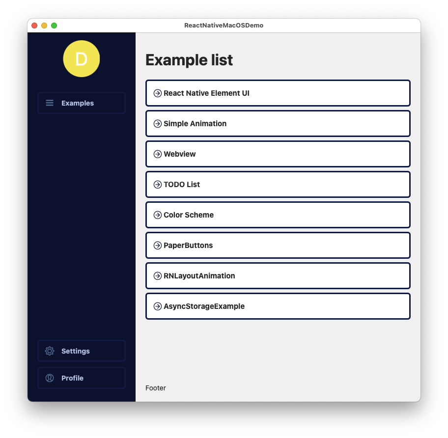
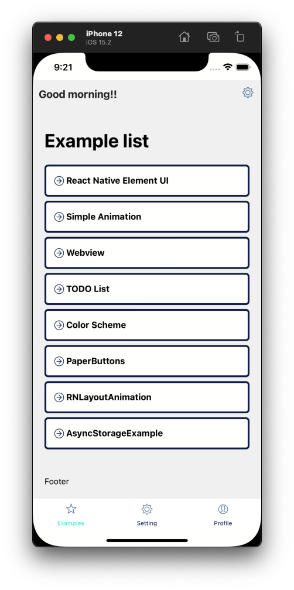

# About The Project

This is a demo project to demonstrate the features that can be built on desktop app by using React Native

The purposes of this project are:

- [-] To test UI libraries can be used 
- [-] How to build and export macOS app by using command line or XCode
- [-] Test some common used libraries
- [-] How to convert an exist React Native project to a project supports desktop version
- [-] Test some animation library and their performance.
- [] Test how to deal with different layouts on mobile and desktop app with one codebase

<div align="center">


</div>

# Getting Started

## Installation

- Install NPM packages

```
yarn install
```

- Install iOS and macOS CocoaPods package 

```
yarn pod
```

## Development

Run iOS version

```
yarn ios
```

Run macOS version 

```
yarn mac
```

## Build macOS version

```
yarn mac:build
```

